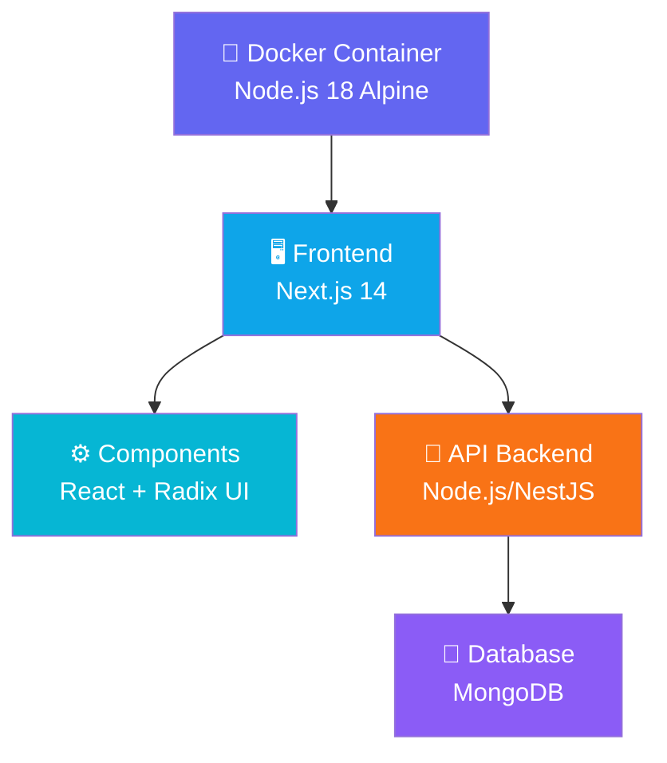

# Escopo do Projeto

O projeto consiste em uma aplicação frontend desenvolvida com **Next.js** para a coleta e gerenciamento de dados dos centros da Aliança Espírita Evangélica (AEE). A aplicação fornece formulários, dashboards e relatórios para coordenadores e administradores.

## Funcionalidades Principais
- Autenticação e autorização de usuários
- Cadastro e gerenciamento de centros
- Coleta de dados através de formulários dinâmicos
- Relatórios e análises de dados
- Histórico de submissões
- Validação de dados por coordenadores
- Dashboard com gráficos e resumos

# Tecnologias Utilizadas

## Frontend
- **Framework**: Next.js 14 (React 18)
- **Linguagem**: TypeScript 5
- **Styling**: Tailwind CSS 3 + PostCSS
- **UI Components**: Radix UI
- **Gráficos**: Chart.js + chartjs-plugin-datalabels
- **Ícones**: Lucide React + React Icons
- **Gerenciamento de Estado**: React Context API
- **Tabelas**: TanStack React Table
- **Utilitários**: clsx, tailwind-merge, date-fns

## Backend & Infraestrutura
- **Conecta com**: API Backend (Node.js/NestJS - repositório separado)
- **Containerização**: Docker + Docker Compose
- **Node.js**: v18 Alpine

# Estrutura do Projeto

```
├── app/                          # Diretório principal (Next.js App Router)
│   ├── actions/                  # Server Actions
│   ├── api/                      # API Routes
│   ├── helpers/                  # Funções utilitárias
│   ├── login/                    # Página de login
│   ├── cadastro/                 # Páginas de cadastro e histórico
│   ├── pessoas/                  # Gerenciamento de pessoas
│   ├── credenciais/              # Gerenciamento de credenciais
│   ├── relatorio/                # Relatórios
│   ├── resumo/                   # Resumos (aliança, coordenador)
│   └── [...]                     # Outras páginas
├── components/                   # Componentes React reutilizáveis
│   ├── ui/                       # Componentes base (Radix UI)
│   ├── hooks/                    # Custom Hooks
│   └── [...]                     # Componentes específicos
├── context/                      # Contextos React (UserContext)
├── interfaces/                   # Tipos e interfaces TypeScript
├── lib/                          # Funções utilitárias (API, utils)
├── public/                       # Assets estáticos
├── docs/                         # Documentação
├── scripts/                      # Scripts de manutenção
├── next.config.mjs              # Configuração Next.js
├── tailwind.config.ts           # Configuração Tailwind CSS
├── tsconfig.json                # Configuração TypeScript
├── Dockerfile                    # Container Docker
└── docker-compose.yml           # Orquestração Docker
```

# Diagrama básico de arquitetura



# Configuração e Execução

## Desenvolvimento
```bash
npm install
npm run dev
# Acessa em http://localhost:3000
```

## Build e Deploy
```bash
npm run build
npm start
```

## Docker
```bash
docker-compose up --build
```

## Variáveis de Ambiente
- `NEXT_PUBLIC_API_URL`: URL da API Backend (obrigatória)

# Path Aliases (TypeScript)
```
@/*                 → ./
@components/*       → ./components/
@/interfaces/*      → ./interfaces/
@/hooks/*           → ./components/hooks/
@/helpers/*         → ./app/helpers/
```
