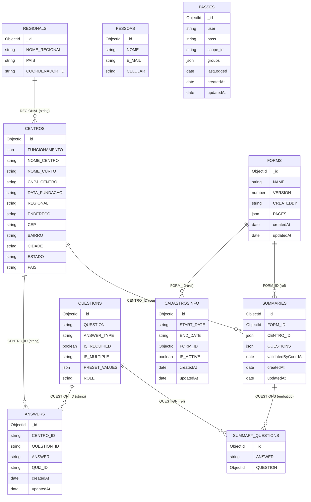

# Modelo de dados atual

Este documento descreve o modelo MongoDB gerado pelos arquivos `*.schema.ts` do projeto.
Os nomes abaixo são os nomes efetivos das coleções, considerando o registro dos models no
`PersistenceModule` e a pluralização padrão do Mongoose.

## Visão geral



> No diagrama, `E_MAIL` representa a chave persistida literal `E-MAIL`, adaptada porque o
> hífen não é adequado como identificador no bloco Mermaid.

## Coleções

### `regionals`

Model registrado como `Regional`, definido em `src/regionais/schemas/regionais.schema.ts`.

| Campo            | Tipo Mongoose | Regras                 |
| ---------------- | ------------- | ---------------------- |
| `_id`            | `ObjectId`    | Gerado automaticamente |
| `NOME_REGIONAL`  | `String`      | Opcional no schema     |
| `PAIS`           | `String`      | Opcional no schema     |
| `COORDENADOR_ID` | `String`      | Sem `ref` Mongoose     |

### `centros`

Model registrado como `Centro`, definido em `src/centros/schemas/centro.schema.ts`.

| Campo           | Tipo Mongoose | Regras                            |
| --------------- | ------------- | --------------------------------- |
| `_id`           | `ObjectId`    | Gerado automaticamente            |
| `FUNCIONAMENTO` | `Mixed`       | Estrutura lógica detalhada abaixo |
| `NOME_CENTRO`   | `String`      | Opcional no schema                |
| `NOME_CURTO`    | `String`      | Opcional no schema                |
| `CNPJ_CENTRO`   | `String`      | Opcional no schema                |
| `DATA_FUNDACAO` | `String`      | Opcional no schema                |
| `REGIONAL`      | `String`      | Identificador sem `ref` Mongoose  |
| `ENDERECO`      | `String`      | Opcional no schema                |
| `CEP`           | `String`      | Opcional no schema                |
| `BAIRRO`        | `String`      | Opcional no schema                |
| `CIDADE`        | `String`      | Opcional no schema                |
| `ESTADO`        | `String`      | Opcional no schema                |
| `PAIS`          | `String`      | Opcional no schema                |

`FUNCIONAMENTO` usa `FuncionamentoDto` como tipo no decorator, mas o schema gerado o trata
como `Mixed`. A estrutura esperada pela aplicação é:

```text
FUNCIONAMENTO {
  segunda: string[]
  terca: string[]
  quarta: string[]
  quinta: string[]
  sexta: string[]
  sabado: string[]
  domingo: string[]
}
```

### `cadastrosinfo`

Model registrado como `CadastroInfoSchemaClass`, definido em
`src/cadastro-info/schemas/cadastro-info.schema.ts`. É a única coleção com nome definido
explicitamente no decorator `@Schema`.

| Campo        | Tipo Mongoose | Regras                        |
| ------------ | ------------- | ----------------------------- |
| `_id`        | `ObjectId`    | Gerado automaticamente        |
| `START_DATE` | `String`      | Obrigatório                   |
| `END_DATE`   | `String`      | Obrigatório                   |
| `FORM_ID`    | `ObjectId`    | Obrigatório; `ref: Forms`     |
| `IS_ACTIVE`  | `Boolean`     | Obrigatório; padrão `true`    |
| `createdAt`  | `Date`        | Gerado por `timestamps: true` |
| `updatedAt`  | `Date`        | Gerado por `timestamps: true` |

As datas são armazenadas como texto. O DTO HTTP exige o formato `DD/MM/AAAA`, mas essa
restrição não está declarada no schema Mongoose.

### `forms`

Model registrado como `Forms`, definido em `src/forms/schemas/forms.schema.ts`.

| Campo       | Tipo Mongoose  | Regras                            |
| ----------- | -------------- | --------------------------------- |
| `_id`       | `ObjectId`     | Gerado automaticamente            |
| `NAME`      | `String`       | Opcional no schema                |
| `VERSION`   | `Number`       | Opcional no schema                |
| `CREATEDBY` | `String`       | Opcional no schema                |
| `PAGES`     | `Array<Mixed>` | Estrutura lógica detalhada abaixo |
| `createdAt` | `Date`         | Gerado por `timestamps: true`     |
| `updatedAt` | `Date`         | Gerado por `timestamps: true`     |

As classes auxiliares no mesmo arquivo descrevem esta estrutura lógica:

```text
PAGES[] {
  NAME: string
  ROLE: string
  QUIZES[] {
    CATEGORY: string
    QUESTIONS[] {
      GROUP: ObjectId[] -> questions
      IS_MULTIPLE: boolean
    }
  }
}
```

Entretanto, `Forms.PAGES` está declarado apenas com `@Prop()` e o tipo refletido é `Array`.
Por isso, no `FormSchema` efetivamente registrado, os itens são `Mixed`: os campos internos,
tipos e referências acima não são validados pelo Mongoose.

### `questions`

Model registrado como `Questions`, definido em `src/questions/schemas/questions.schema.ts`.

| Campo           | Tipo Mongoose | Regras                                    |
| --------------- | ------------- | ----------------------------------------- |
| `_id`           | `ObjectId`    | Gerado automaticamente                    |
| `QUESTION`      | `String`      | Opcional no schema                        |
| `ANSWER_TYPE`   | `String`      | Opcional no schema                        |
| `IS_REQUIRED`   | `Boolean`     | Opcional no schema                        |
| `IS_MULTIPLE`   | `String`      | Apesar do nome, o tipo persistido é texto |
| `PRESET_VALUES` | `String[]`    | Opcional no schema                        |
| `ROLE`          | `String`      | Opcional no schema                        |

### `answers`

Model registrado como `Answers`, definido em `src/answers/schemas/answers.schema.ts`.

| Campo         | Tipo Mongoose | Regras                        |
| ------------- | ------------- | ----------------------------- |
| `_id`         | `ObjectId`    | Gerado automaticamente        |
| `CENTRO_ID`   | `String`      | Sem `ref` Mongoose            |
| `QUESTION_ID` | `String`      | Sem `ref` Mongoose            |
| `ANSWER`      | `String`      | Opcional no schema            |
| `QUIZ_ID`     | `String`      | Sem `ref` Mongoose            |
| `createdAt`   | `Date`        | Gerado por `timestamps: true` |
| `updatedAt`   | `Date`        | Gerado por `timestamps: true` |

### `summaries`

Model registrado como `Summaries`, definido em `src/summary/schemas/summaries.schema.ts`.

| Campo                | Tipo Mongoose       | Regras                                        |
| -------------------- | ------------------- | --------------------------------------------- |
| `_id`                | `ObjectId`          | Gerado automaticamente                        |
| `FORM_ID`            | `ObjectId`          | `ref: Forms`; opcional no schema              |
| `CENTRO_ID`          | `Mixed`             | Sem `ref`; usa `CreateCentroDto` no decorator |
| `QUESTIONS`          | `SummaryQuestion[]` | Subdocumentos detalhados abaixo               |
| `validatedByCoordAt` | `Date`              | Opcional                                      |
| `createdAt`          | `Date`              | Gerado por `timestamps: true`                 |
| `updatedAt`          | `Date`              | Gerado por `timestamps: true`                 |

Cada item de `QUESTIONS` possui:

| Campo      | Tipo Mongoose | Regras                                     |
| ---------- | ------------- | ------------------------------------------ |
| `_id`      | `ObjectId`    | Gerado automaticamente para o subdocumento |
| `ANSWER`   | `String`      | Opcional no schema                         |
| `QUESTION` | `ObjectId`    | `ref: Questions`; opcional no schema       |

### `pessoas`

Model registrado como `Pessoas`, definido em `src/pessoas/schemas/pessoas.schema.ts`.

| Campo     | Tipo Mongoose | Regras                        |
| --------- | ------------- | ----------------------------- |
| `_id`     | `ObjectId`    | Gerado automaticamente        |
| `NOME`    | `String`      | Opcional no schema            |
| `E-MAIL`  | `String`      | Chave persistida contém hífen |
| `CELULAR` | `String`      | Opcional no schema            |

### `passes`

Model registrado como `Passes`, definido em `src/passes/schemas/passes.schema.ts`.

| Campo        | Tipo Mongoose | Regras                        |
| ------------ | ------------- | ----------------------------- |
| `_id`        | `ObjectId`    | Gerado automaticamente        |
| `user`       | `String`      | Opcional no schema            |
| `pass`       | `String`      | Opcional no schema            |
| `scope_id`   | `String`      | Sem `ref` Mongoose            |
| `groups`     | `String[]`    | Opcional no schema            |
| `lastLogged` | `Date`        | Padrão `null`                 |
| `createdAt`  | `Date`        | Gerado por `timestamps: true` |
| `updatedAt`  | `Date`        | Gerado por `timestamps: true` |

## Relacionamentos

Os únicos relacionamentos declarados com `ObjectId` e `ref` no schema Mongoose registrado são:

| Origem                           | Destino         | Definição                    |
| -------------------------------- | --------------- | ---------------------------- |
| `cadastrosinfo.FORM_ID`          | `forms._id`     | `ObjectId`, `ref: Forms`     |
| `summaries.FORM_ID`              | `forms._id`     | `ObjectId`, `ref: Forms`     |
| `summaries.QUESTIONS[].QUESTION` | `questions._id` | `ObjectId`, `ref: Questions` |

Os demais vínculos são convenções da aplicação e não referências Mongoose:

| Origem                     | Destino lógico              | Tipo persistido |
| -------------------------- | --------------------------- | --------------- |
| `centros.REGIONAL`         | `regionals._id`             | `String`        |
| `regionals.COORDENADOR_ID` | pessoa/coordenador          | `String`        |
| `answers.CENTRO_ID`        | `centros._id`               | `String`        |
| `answers.QUESTION_ID`      | `questions._id`             | `String`        |
| `answers.QUIZ_ID`          | quiz embutido em formulário | `String`        |
| `summaries.CENTRO_ID`      | `centros._id`               | `Mixed`         |
| `passes.scope_id`          | escopo da credencial        | `String`        |

## Comportamentos comuns

- Todos os documentos raiz recebem `_id: ObjectId` e `__v: Number` automaticamente.
- Apenas `answers`, `cadastrosinfo`, `forms`, `passes` e `summaries` usam
  `timestamps: true`.
- Nenhum dos arquivos de schema declara índices, unicidade ou validações customizadas.
- Com exceção dos quatro campos marcados como obrigatórios em `cadastrosinfo`, os campos são
  opcionais no nível do Mongoose. DTOs e serviços podem impor regras adicionais na API.
- As coleções `centros`, `pessoas`, `questions`, `regionals` não possuem timestamps definidos
  em seus schemas.

## Arquivos considerados

- `src/answers/schemas/answers.schema.ts`
- `src/cadastro-info/schemas/cadastro-info.schema.ts`
- `src/centros/schemas/centro.schema.ts`
- `src/forms/schemas/forms.schema.ts`
- `src/passes/schemas/passes.schema.ts`
- `src/pessoas/schemas/pessoas.schema.ts`
- `src/questions/schemas/questions.schema.ts`
- `src/regionais/schemas/regionais.schema.ts`
- `src/summary/schemas/summaries.schema.ts`

Última revisão dos schemas: 2026-06-07.
